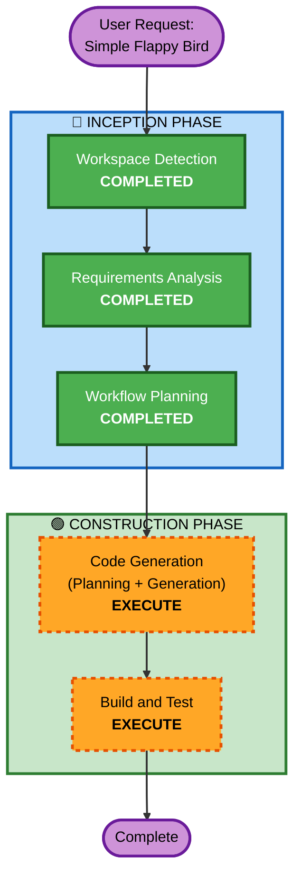

# Execution Plan

## Detailed Analysis Summary

### Change Impact Assessment
- **User-facing changes**: Yes — New game application (full user experience)
- **Structural changes**: No — Greenfield project, no existing architecture
- **Data model changes**: No — No persistent data; in-memory game state only
- **API changes**: No — No APIs; client-side only
- **NFR impact**: Yes — Performance (60 FPS), Security (headers, exception handling), Testing (PBT)

### Risk Assessment
- **Risk Level**: Low
- **Rollback Complexity**: Easy (greenfield, no dependencies)
- **Testing Complexity**: Moderate (game physics properties require PBT)

## Workflow Visualization



### Text Alternative
```
Phase 1: INCEPTION
  - Workspace Detection (COMPLETED)
  - Requirements Analysis (COMPLETED)
  - Workflow Planning (COMPLETED)

Phase 2: CONSTRUCTION
  - Code Generation (EXECUTE)
  - Build and Test (EXECUTE)
```

## Phases to Execute

### 🔵 INCEPTION PHASE
- [x] Workspace Detection (COMPLETED)
- [x] Requirements Analysis (COMPLETED)
- [x] Workflow Planning (COMPLETED)
- [x] Reverse Engineering — SKIPPED (Greenfield)
- [x] User Stories — SKIPPED (Simple game, single user type, no complex workflows)
- [x] Application Design — SKIPPED (Single component, no service layer needed)
- [x] Units Generation — SKIPPED (Single unit of work)

### 🟢 CONSTRUCTION PHASE
- [ ] Functional Design — SKIP
  - **Rationale**: Game mechanics are well-understood (gravity, collision, scoring). No complex business rules requiring detailed design.
- [ ] NFR Requirements — SKIP
  - **Rationale**: Tech stack already decided (vanilla JS + Canvas). NFRs documented in requirements.
- [ ] NFR Design — SKIP
  - **Rationale**: No NFR patterns to incorporate beyond what's covered in code generation.
- [ ] Infrastructure Design — SKIP
  - **Rationale**: No infrastructure. Local files only, no server, no cloud resources.
- [ ] Code Generation — EXECUTE (ALWAYS)
  - **Rationale**: Implementation planning and code generation needed. Will include PBT test generation.
- [ ] Build and Test — EXECUTE (ALWAYS)
  - **Rationale**: Build verification and test execution instructions needed.

### 🟡 OPERATIONS PHASE
- [ ] All stages — SKIP
  - **Rationale**: Local file deployment. No server, no cloud, no CI/CD needed.

## Estimated Timeline
- **Total Stages to Execute**: 2 (Code Generation + Build and Test)
- **Estimated Duration**: Single session

## Success Criteria
- **Primary Goal**: Working Flappy Bird game playable in browser
- **Key Deliverables**:
  - index.html — Game entry point
  - game.js — Game logic (modular, well-structured)
  - style.css — Minimal styling
  - Property-based tests with fast-check
  - Build and test instructions
- **Quality Gates**:
  - Game runs at 60 FPS
  - All PBT properties pass
  - Security-applicable rules compliant
  - Opens and plays correctly from file:// protocol
